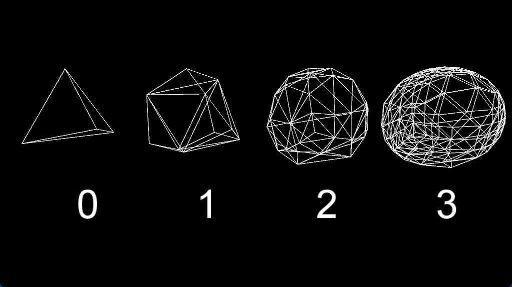

# Geosphere: Recursive Geometry in Motion

A visualization of the geosphere, a spherical approximation generated through recursive triangle subdivision. From a tetrahedron, faces are repeatedly divided, revealing the emergence of a sphere.

**Running the Sketch:** Open `geosphere.pde` in Processing and click "Run".